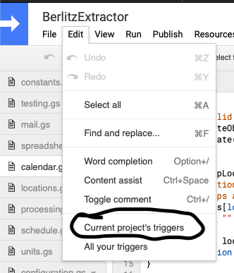
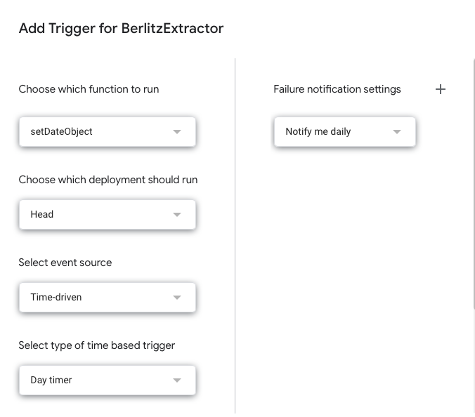
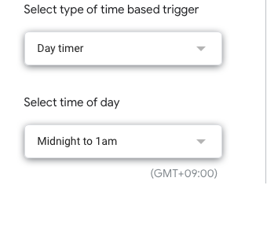

# WorkScheduleAutomation

Automate calendar, spreadsheet updating based on email sent from work.

## Index:
- [Setup](#setup)
- [Known Issues](#known-issues)

## Setup

### Options:
1. Copy the code from the files directly and save in files with .gs extention in [Google Script](https://script.google.com)

  1. Login and create a new Project.
  2. Create and copy files. File names really don't matter. But best to be organised.
  3. Setup the configuration.gs file to match your needs.
  4. Setup a daily trigger to run some time after the schedule has been posted. [Here](#trigger)

2. Clone this repo and then use 'clasp' to push the code to GoogleScript. See [Video Here](https://www.youtube.com/watch?v=V_7kvwcZf_c)

### Things you need to do:

You will need to create or use an existing calendar. Determine its ID. You can get the ID by opening your google calendar.

1. Navigate to Calendar and click on the three vertical dots

2. Select "Settings and Sharing"

3. Below Integrate Calendar

You will need to create a spreadsheet in your google drive and get its ID
The ID can be found in the spreadsheet's url located between d/SPREADSHEET_ID/edit#gid=0

A sample is located [here](https://docs.google.com/spreadsheets/d/1tRVtJX-2Bsn7vXIexK3Dtop5ko2BiFF2Hp83wuJrtPI/edit?usp=sharing)

You will need to set your configuration options using the the above details.

Set up a trigger

In order for this to be automated. You need to set up a tigger that runs by itself.

1. Open your project and select 'Edit' -> 'Current Project Triggers'

2. Click on the 'Add Trigger' Its a nice large blue Button, probably in the lower right corner.

3. 'Select type of time based trigger' Set this to 'Day timer' I have mine set to sometime after 7pm.

4. Select the time window for execution. 'Select time of day'

### Known Issues:
1. If there is more than a single message in a thread. The last message may not be processed. Resulting in the calendar and spreadsheet not being correct.
2. If the schedule is updated the next day. You will need to manually process the email. To do this.
  1. Log in to gmail and remove the "Processed"  label from thread.
  2. Switch to google script. Manaully run the nightlyProcess function.
