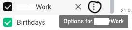
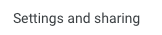
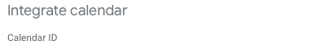

# WorkScheduleAutomation
Automate calendar, spreadsheet updating based on email sent from work

## Setup

  ### Options:
  1. Copy the code from the files directly and save in files with .gs extention in GoogleScript

  2. Clone this repo and then use 'clasp' to push the code to GoogleScript. See [Video Here](https://www.youtube.com/watch?v=V_7kvwcZf_c)

### Things you need to do:

You will need to create or use an existing calendar. Determine its ID. You can get the ID by opening your google calendar. 

1. Navigate to Calendar and click on the three vertical dots 

2. Select "Settings and Sharing" 

3. Below Integrate Calendar

You will need to create a spreadsheet in your google drive and get its ID
The ID can be found in the spreadsheet's url located between d/SPREADSHEET_ID/edit#gid=0

A sample is located [here](https://docs.google.com/spreadsheets/d/1tRVtJX-2Bsn7vXIexK3Dtop5ko2BiFF2Hp83wuJrtPI/edit?usp=sharing)

You will need to set your configuration options using the the above details.
